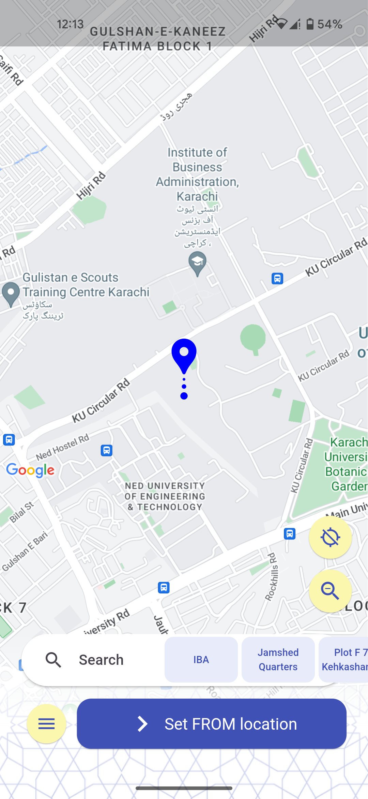
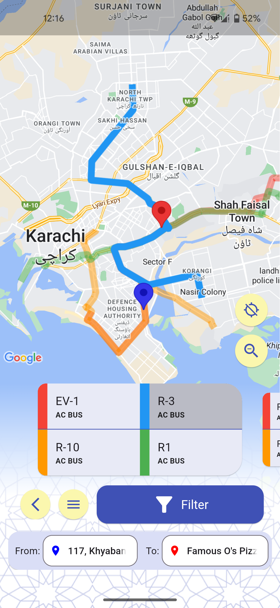
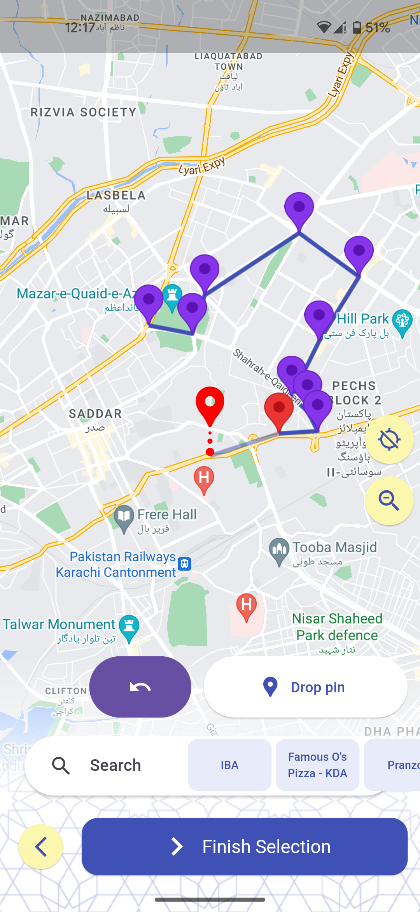
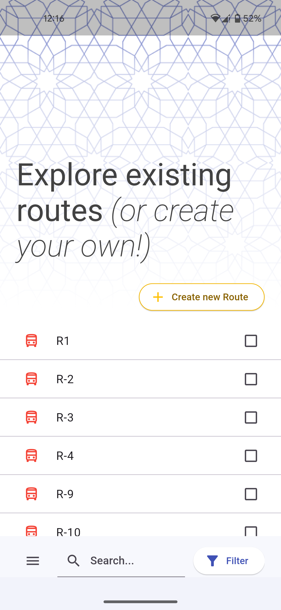

In Karachi, public transport routes were available either in a static manner **only** for the Air conditioned buses:

Or as an outdated list of points that were extremely **time consuming** to navigate and **unreliable**.

But not for much longer!

<insert pointr logo>

# Welcome to Pointr

Pointr is an open-source app for navigating public transport based on a community contribution model. It is limited to Karachi at this time.

  
   
  
   

- View A/C Bus, Minibus and Chinchi routes
- Create custom routes and share them
- Use Google Maps and Places Search to set the stops of your journey
- View routes ranked by their suitability for your journey

## Contribution

Thanks to Zaineb Makati of Habib University for sharing the minibus routes and pedestrian stops.

Create a pull request with hardcoded routes to contribute. Hardcoded routes are contained in lib/infrastructure/data/hardcoded_routes.dart

## For Devs

add a file named "api_keys.json" to the root of the project containing the following

{
"GMAP_KEY": "AIza...",
"env": "dev
}
